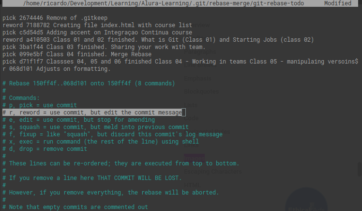
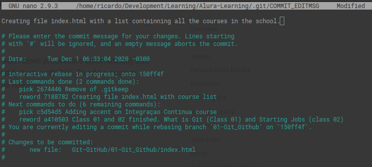
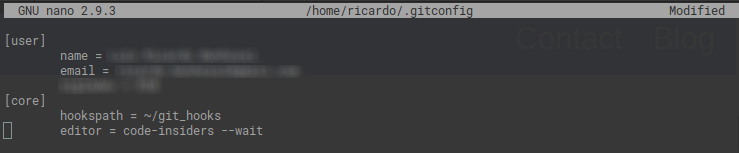

# Git and GitHub course notes

### How Git Works

Git controls all modificantions in the files of the repository, creating a history of changes that the files has passed by over the time.

Git has 3 basic stages:
  1. Working tree
    Here are the files you are editing and modifying at te moment.
  2. Stage
    Here are the files you finish modifying and are ready to be commited
  3. HEAD
    Here is the files you already commited.

Git workflow to consolidate your changes to HEAD, is:
  1. finish your changes and save the file.
  2. add the file(s) to stage area (git add)
  3. commit these changes (git commit)

You can literally see how git works using https://git-school.github.io/visualizing-git/.
## Branches

Git allows you to create branches to split the work you've to do. Usualy the main branch, that will contains all the consolidated changes is MASTER.
When you create a branch, git will create another line, as the follow exemple:
```
master (HEAD)
   |──── branch01
             |──── branch01.1
   |──── branch02
```
In this case, the changes you do on the other branches (branch01 and branch01.1), will not be in master and vice versa.
See the commands to work with branches on line 99.

It is very important to slpit the development in branches. This way what a Developer01 is working on (on branch feature01) does not affect the changes
Developer02 is doing on branch feature02. Both branches are isolated and the changes will not overwrite it selves.

When the feature developed on feature01 is done, you join it on branch master using the command git merge.

 - **HEAD**: the HEAD shows where your repository is. It will be always the last commit you did.
### Conventions

- Commit
  - The commit should contains a small bunch of changes or a feature (or a significant part of it). So if you have big changes to make, split it in smalls changes
  - **Avoid commits with too much changes.** Split the changes into small changes when it is possible.
  - The commit message should be a short, but clear, message that shows what changes that commit contains.
  - When to commit your code?
    That depends on how each team works, but in general, we should follow some tips:
    - Commit your code when a bug is fixed. If it is a big fix, try to split it into small pack of changes to commit inparts (changes in one file, for exemple)
    - Commit it when you add a small new feature, or when a small part of a big new feture is done.
    - When our code is in a state that you would like to remember.
    - **You should not commit code that doesn't work**. Altought is not recommended to olnly commit in the endo of a feature/bug fix.
  - If you commited

### General Commands

- Initializing a git repo
  - **git init**
  This command initialize the current folder as a git repository to git start tracking it.
  - **git init --bare**
  This command do the same as git init but it creates a repository that will cointaisn only the changes of the files and not a copy of the files it self.
  It means that we won't use it to access and change files. It is just to store the changes. It's used to create remte repositories.

- Remote repo (on a server, another folder or GitHub)
  - **git remote**
    > It lists all the remote repositories of the repo you're in. Will show blank if there is none.
  - **git remote add**
    > This command adds a remote repository to your local repository.
    > the command should have a name and the address of the remote repository (URL, lan address, local).
    > E.g.: git remote add name_remote https://remote_repo.com.br/address.

- Satging files
  - **git add .** or **git add <file_name>**
    > This command add the files to the stage area. This area holds the   files selected to be commited.
    > Use "." to add all the changed files.
    > Use the file_name you want to stage a specific file. You can put  more than one file.

- Commiting your changes
  - **git commit -m "message that describes the changes you made.**
    > This command consolidate your changes in a "package" and we used to put some short message.

- Syncronizing between local and remote repos
  - **git push**
    > This command pushes your changes to the remote server you configure   as remote.
    > E.g.: git push remote_name_you_gave_when_add_remote branch_you_want_to_push

  - **git pull**
    > This command gets the data of the remote repositori and brings to your local branches.
    > **By default, when you clone a remote repository, git name it remote as ORIGIN.** To change it use git remote rename old_name new_name.
    > E.g.: git pull remote_repository_name v (optional)

  - **git clone**
    > Used to make a copy of the remote repository you want.
    > E.g.: git clone https://remote_repo.com.br/address folder_name_you_want_create (optional)

- Checking out your the situation of your branch/repo
  - **git status**
    > Show the status of your repo, if there is changes staged or not, if there is chages to be pushed, etc.

  - **git log**
    > Shows you all the history of channges in your repository.
    > See http://devhints.io/git-log to have some tips and how to use it.
    - **git log --oneline**
      > Shows you a simplified log with short has and message of the commit.
    - **git log -n N**
      > Shows you the last N commits you want.

- git branch commands
  - **git branch**
    > List all the branches you have on your repository.
  - **git branch branch_name**
    > Create a new branch with the name you gave it on branch_name.
  - **git switch branch_name or git checkout branch_name**
    > Change the repository you're working on to the v repository.
  - **git checkout <u> -b</u> branch_name**
    > Creates a new branch and change to the new branch.

- Joining changes
  - **git merge branch01 branch02**
    > This command take the changes you made in one branch and put it   inside another.
    > To do it, you just need to checkout to the branch you want merge in   the changes (branch01, and there you execute the command.

  - **git rebase v**
    > This command takes the commits of the branch origin and put behind  on the branch you you're rebasing.
    > it will bring v commits to be the base of the branch you're in.
    **BE CAREFUL**: could make you lose the work.

- undoing changes (ctrl + Z)
  - **git checkout -- file_name**
    > reverting what is in the working tree (not staged or commited).
  - **git reset HEAD**
    > reverting what you've already add to stage.
    > You can use an specific commit instead of HEAD.
  - **git revert commit_hash**
    > reverting what you already have commited.
#### Other commands

- Ignoring files/folders
You can make Git to ignore some file or folders. You just need to add a special file named **.gitignore** to your project.
  - **.gitignore** (file)
    > Inside this file you just add the the files and folder (using / at  the end) that you don't want git tracks.
    > So now, if you type git status, git won't show you to commit the  files or folders you set to be ignored.
    > Altough git won't track these files, it will show you to commit the . gitignore file.


- Stash your changes
Git allows you to "save" your changes in a temporary stack (aside the main stack of your project) and won't show it in your git log.
  - **git stash**
    > This command will "commit" your changes to the stash area. You can set a message to this stash. Just type it after the word stash
  - **git stash list**
    > This command will list all you have on stash area by a number into {}
  - **git stash apply**
    > This command will restore the last thing you stashed. You can apply a specific stash by informing the stash number (see git statsh list).
  - **git stash drop**
    > This command will discard the last thing you stashed. You can drop a specific stash by informing the stash number (see git statsh list).
  - **git pop**
    > This command will execute a stash apply followed by a stash drop. You can use it to restore a specific stash by informing the stash number (see git statsh list).

- Navigate through commits
Using Git, you can navigate through commits an restore you project to an specific commit.
  - **git checkout commit_hash**
    > By using this command you set HEAD of your project to the commit you want.
    > **OBS:** when use git checkout commit_hash, you are **deatached** of the main source control. That is, you're not in any branch.
    > So, if you make a commit here and change to MASTER, these commits will be lost and you couldn't retrive in in the future.
    > If you want to make these commit achieveble, you have to **create a new branch** after moving ead to the commit you want.
  - **git checkout -b new_branch**
    > This way, this new_branch is based on the commit you've checkout out before.

- **git diff**
  > This command will show the differences between the last commit and your unstaged changes. If you stage it, it won't show anything.
  - **git diff old_hash_commit..new_hash_commit**
    > Here we can see the differences between 2 commits. The .. can be translate as until. So, by using this command, you're able to see all the changes occured bewteen these commits. You can also use only **git diff old_hash_commit** to compare with HEAD.

- Marking a specific point
You can create a tag, a mark on the history of your project for a version release for exemple
  - **git tag -a tag_name**
    > This command will create a tag in HEAD. You can also set a message to this tag using -m 'message'.
    > You can create a tag on a specific commit to.
    > When you use github, these tag will apperar in RELEASE and can be downloaded.
  - **git push origin tag_name**
    > This command will push your tags to the remote server.
  - **git tag**
    > This commnand lists all the tags you have.
  - **git checkout tag_name**
    > You can also checkout your project to a specific tag. Use this command to do it.

- Checking/Changing the remote address
  - **git remote get-url origin**
    > This command will show you the current address of your remote repo.
  - **git remote set-url origin url_address**
    > With this command you change the address your remote repo origin is pointing to.

### Problem Solving

- **Wrong commit message**
Sometimes, when you are working focused and committed, your commit messages could contains typo mistakes or messages that is not so clear or related to what you did in the code.
It, can happen... ¯\\\_(ツ)_/¯
When these kind of mistakes happens, it is recommended to fix your commit message. You can do it in 2 ways:

  - **git commit <u> --amend</u> -m 'correct_messege'** (fixing last commit message)
    > With the **amend** option you can replace the wrong commit message you wright on the laste comit to another message. This fix is more direct and fast. So, if you find out you commited some code with a wrong message, fix it right now.
    > With amend option the previous wrong commit will no longer exist.
  **Avoid amending commits that already have been pushed**. It can be forced, but can cause issues to people who based branches on this commit.

  - **git rebase --interactive HEAD~N** (fixing an older or multiple commits)
    > This method will basically rebase your branch based on it self.
    > When you use the command --interactive with HEAD~N (where "N" is the number of commits you want to "regress"), it shows you a list of all the commits in this range and it allows you to choose what to do with every commit in this list.
    > To edit the commit message, just change **PICK** in the start of the line to **REWORD** or just "**r**" and save your changes.
    > 
    > After that, git will open an editor for each commit marked as REWORD for you to edit. Make the changes you need/want and save it.
    > 
    > Now you just need to push your changes.
    > **TIP**: if you use Visual Studio Code, the extension Git Lens can make this process easier and visual. Just need to add code-insiders --wait or code --wait to the CORE of your .gitconfig file.
    > 
    > Now, when you need to fix some old commit messages, just do as the previous rebase command, but now, instead of doing the changes through the teminal, you can do it in a more visually way inside the Visual Studio Code
    > 

This tip was took from https://linuxize.com/post/change-git-commit-message/https://linuxize.com/post/change-git-commit-message/
